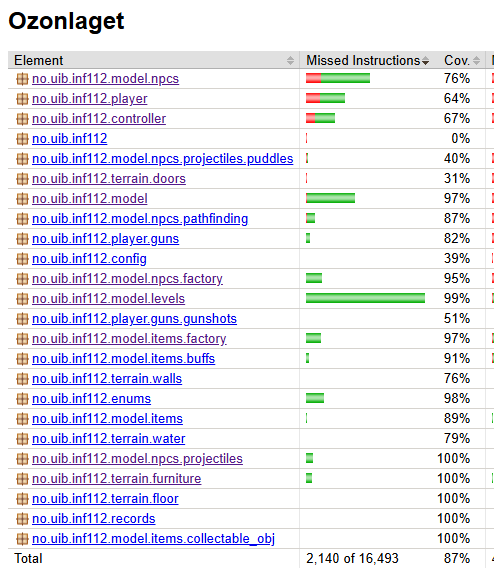

# Rapport – innlevering 4
**Team:** *Ozonlaget* – *Alexander Nåmdal, Johs Grødem Larsen, Rein Endre Landmark, Sander Aubell Ahlgren, William Sjølett*

## Team / Prosjekt

    Ozonlaget / Kurt-Mario Zombie Adventure

### Roller i teamet
    - Rein:
        - Arbeidsfordeling/Samkjøring
        - System-design
        - Musikk/Lyd
        - NPC design
    
    - Alexander:
        - Algoritmeansvarlig
        - Stifinning
        - Pickup-items

    - Johs:
        - Resource manager
        - Grand artist of sprites
        - Accessibility

    - Sander:
        - Menyansvarlig
        - Assistant level designer

    - William:
        - Lead level designer
        - Character controls

## Konsept

    Vi har laget et zombie-shooter spill der målet er å navigere seg rundt på kartet med WASD eller piltastene for å plukke opp diverse objekter vi trenger for å vinne spillet.
    På veien vil player møte på ulike typer zombier som vil hindre progresjon og (som zombier gjør) prøve å angripe player. Man kan forsvare seg med enten å løpe vekk eller å skyte zombiene med tre ulike våpentyper. Dette kan gjøres ved å trykke på skjermen for å skyte og ved å bruke 1-2-3 tastene for å bytte våpen.
    
    En av utfordringene er definitivt å rasjonere ammunisjon slik at man ikke går tom på værst tenkelige øyeblikk.

    Player kan også ta i bruk et sortiment av buffs som vil assistere på ulike måter, som raskere bevegelse, mer skade, mer armor m.m.

    Når spiller har herjet nok rundt i nabolaget vil han tiltrekke seg oppmerksomheten til Gigachad - bossen. Det er hell i uhell, for Gigachad har også nøkkelkortet man trenger for å bruke helikopteret.

    Helikopteret er veien ut, men det er tomt for bensin, innelåst bak et piggtrådgjærde og vi har som sagt ikke nøkkelkortet. Player må finne en nøkkel for å låse opp porten, samle inn nok bensin og finne nøkkelkortet.

    I menyen finner du knapper for å starte spillet, help-menyen som fungerer som en kjapp introduksjon til spillet, se på settings der man kan velge mellom vanskelighet, samt et par accessibility options,

## KANBAN

    Vi valgte Kanban da dette lot oss jobbe mer individuelt i eget tempo - til fordel for et mer synkronisert og høy-organisert alternativ i Scrum. Vi er alle studenter med ulik arbeidskapasitet og tidsbudsjett, noe som passer bedre for en kontinuerlig arbeidsflyt som Kanban tilbyr. Scrum krever også vesentlig mer planlegging og samkjøring, noe som ville krevd flere møter enn vi var interressert i.

    Vi har benyttet oss av issue-board på git som en virituell table der vi har opprettet ting vi enten på møter eller individuelt har funnet ut at trengs å gjøres, og vi har plukket oppgaver fra tavlen og utført de kontinuerlig gjennom hele semesteret.

    En liten modifikasjon vi har gjort er at vi har fordelt litt arbeidsoppgaver manuelt også, og ikke bare latt folk plukke oppgaver på måfå. Det hjalp litt med struturen, både for å få arbeidsmengden rettferdig fordelt og for å få gjort viktige oppgaver med en høyere prioritet (litt scrum-aktig).

### Erfaringer med samarbeid og prosjektmetodikk

    I starten var rapportene ikke opp til par, i tillegg til at arbeidsmetodikken ikke fulgte noen spesifikk form. Etter reiterasjoner av rapportene og over tid har både samarbeidskvaliteten og strukturen forbedret seg kraftig. 
    
    Ved bruk av kanban og git-issue boardet som en virituell tavle, har folk plukket opp arbeidsoppgaver og gjennomført de på en god måte. Vi har nå et godt samarbeid der det er tydelig hvem som gjør hva, samt at alle har et klart bilde av hva som er neste steg i utviklingen. 
    
    Det bør påpekes at vi har fordelt arbeidsoppgaver utover dette vha. kommunikasjon i discord, rundt forelesninger og i avtalte møter. Dette er skrevet opp i meldinger i discord gruppen, eller i møtereferater.

### Gruppedynamikk

    Gruppedynamikken er jevnt over god, vi har god kommunikasjon i tillegg til deltakende medlemmer. 
    Vi har diskutert proaktivitet i forhold til det å være kreativ og å ta til seg arbeidsoppgaver som man selv ser som nødvendige/forbedringer. 
    Vi strever etter at alle er komfortable med det de holder på med, diskuterer kode konstruktivt og at det skal være lov å komme med meninger som vi diskuterer og eventuelt stemmer over.

### Kommunikasjon i teamet

    Vi har kommunisert bra, både med ukentlige møter, samt discord. Vi kunne derimot ha avtalt møter litt tydligere og vurdert en frist for å si ifra når/hvis man kommer.

### Retrospektiv

    Dette var ikke noe vi startet med i begynnelsen av prosjektet, men er nå inkorporert i fellesmøtene våre og blir gjort helt i starten slik at vi har et utgangspunkt. Dette har fungert bra, selv om det er relativt nytt.

    - Ting som har blitt nevnt er som følger:
        - Skrevet tester fra starten av
        - Benyttet kanban tidligere
        - Mer effort ifht. rapportskriving
        - Jevne ut antall commits

### Bidrag til kodebasen

    Vi har prøvd å få en gjevn fordeling av hvem som bidrar, men det er fortsatt ujevn fordeling. Det er dog konsensus i gruppen at alle har bidratt nok til at dette ikke er et problem. Noen commits er også en felles commit fra en person sin bruker - f.eks møtereferat/rapportskriving.

### Referat fra møter

Møtereferatene er lagt til i en egen mappe (Ozonlaget\doc\møtereferat).

### Oppsummering og retrospektiv #TODO

For siste innlevering: Gjør et retrospektiv hvor dere vurderer hvordan hele prosjektet har gått. Hva har dere gjort bra, hva hadde dere gjort annerledes hvis dere begynte på nytt?

---

## Krav og spesifikasjon

### Status på krav

Siden forrige møte har vi fokusert veldig på å få et mer spillbart spill. 

    - Vi har implementert en generisk NPC klasse og en fullt fungerende fiende.
    - Vi har implementert skyting og at fiender dør når de har tatt nok skade.
        - 3 ulike våpen
    - Vi har implementert at fiender vandrer rundt tilfeldig frem til de ser player.
    - Fiender angriper player og player tar skade og dør om HP <= 0.
    - Vi har implementert buffs, helse/skjold og ammunisjon pickup items.
    - Du kan nå utføre objektet i spillet og vinne med å fly avgårde i et helikopter.
    - Vi har nå musikk for mange ulike omstendigheter, samt skytelyder og en del andre lydeffekter.
    - Kartet er nå ferdig "møblert" med hus og inventar/terreng.

### MVP-status
##### Meny:

    Startmeny: ferdig
    Settings: ferdig
    Help-meny: ferdig

##### Player

    Kan bevege player: ferdig
    Player er animert: ferdig
    Player kan skyte: ferdig
    Player tar skade og kan dø: ferdig
    3 ulike våpen: ferdig

##### Fiender

    NPC med stifinning: ferdig
    Fiendetyper: 5/5 - ferdig
    Fiender animert: 5/5 - ferdig
    Fiender oppsøker player og angriper: ferdig
    Fiender kan bli skutt og dør: ferdig

##### Lyd

    Lydeffekter: ferdig
    Musikk: ferdig

##### Kart

    Vegger: ferdig
    Møbler: ferdig
    Terreng/gulv: ferdig

##### Items

    Buffs:
        - RainbowBuff: ferdig
        - DamageBuff: ferdig
        - SpeedBuff: ferdig
    Pickup-items:
        - Ammo: ferdig
        - Helse/skjold: ferdig
        - Nøkkel/Bensin: ferdig

##### Victory-condition og objektiver

    - Implementere bensinkanner/helikopterkeycard: ferdig
    - Implementere gate/gatekey: ferdig
    - Implementere helikopter: ferdig
    - Animere helikopter: ferdig
    - Victory-condition (drepe final boss, levere keycard og bensin til helikopter og fly avgårde): ferdig
    - Kan restarte etter game-over eller victory: ferdig

## Brukerhistorier

    Under finner dere noen eksempler på brukerhistorier vi har laget for å forbedre visjonen vår for spillets utvikling.

#### Brukerhistorie 1:

    Historie:
    - Bruker vil kunne skyte zombier.

    Akseptansekriterie:
    - Bruker kan skyte zombier, zombier tar skade og dør når de blir skutt tilstrekkelig ganger.

    Konkrete arbeidsoppgave(r):
    - Implementere gunshots med kollisjon.
    - Implementere takeDamage for zombier.
    - Implementere zombie død.

#### Brukerhistorie 2:

    Historie:
    - Bruker vil kunne plukke opp items og power-ups.

    Akseptansekriterie:
    - Bruker kan bevege karakteren sin over items som ammo og power-ups og få en korresponderende effekt.

    Konkrete arbeidsoppgave(r):
    - Implementere pickup-able-objects.
    - Impementere power-up effekter.
    - Implementere healthpacks og ammo crates.

#### Brukerhistorie 3:

    Historie:
    - Bruker vil ha et godt designet level med mange detaljer.

    Akseptansekriterie:
    - Bruker kan flytte karakteren rundt på levelet ettersom hvor stien går og komme til alle de viktigste punktene.

    Konkrete arbeidsoppgave(r):
    - Implementere et level med en klar og tydelig sti.
    - Implementere bygninger med rom som bruker kan gå inn i.

#### Brukerhistorie 4:

    Historie:
    - Brukeren ønsker en startmeny med flere animerte knapper slik at det er enkelt og oversiktlig å navigere i spillet og velge ulike funksjoner ved hjelp av museklikk.

    Akseptansekriterie:
    - Brukeren kan se en startmeny når spillet starter.
    - Startmenyen inneholder flere knapper (f.eks. Start, Settings, Help).
    - Knappene er animerte.
    - Brukeren kan trykke på knappene med musen.
    - Hver knapp utfører riktig handling.

    Konkrete arbeidsoppgave(r):
    - Implementere en startmeny med bakgrunn og tittel.
    - Implementere animerte knapper som beveger seg inn på skjermen.
    - Implementere hitboxer for knappene.
    - Implementere museklikk for interaksjon med knappene.
    - Koble knappene til riktig funksjonalitet (bytte GameState).
    
#### Brukerhistorie 5:

    Historie:
    - Bruker vil oppleve en utfordrende overlevelsesmodus der fiendene føles smarte og aktivt jakter på karakteren.
    
    Akseptansekriterie:
    - Fiender kan oppdage og navigere mot brukeren, uavhengig av hvor på kartet brukeren gjemmer seg.
    - Fiender patruljerer (wandering) området dynamisk når de ikke har oppdaget brukeren.
    - Brukeren kan ikke stå stille på ett sted uten å bli funnet over tid (ingen 100% trygge soner).
    - Nivået har en tydelig og oppnåelig vinnerbetingelse.

    Konkrete arbeidsoppgave(r):
    - Implementere en tydelig vinnerbetingelse for nivået.
    - Implementere patruljeringslogikk (wandering) for fiender som ikke har et mål.
    - Implementere pathfinding (A*-algoritme) og forfølgelseslogikk slik at fiender effektivt kan navigere rundt hindringer for å ta brukeren.

#### Brukerhistorie 6:

    Historie:
        - Bruker er sensitiv for blinkende lys og vil ha en mulighet for å unngå dette.
    
    Akseptansekriterie:
        - Bruker har mulighet for å skru av blinkende lys.

    Konkrete arbeidsoppgave(r):
        - Legge til en knapp i settings for å skru av blinkende lys.
    
#### Brukerhistorie 7:

    Historie:
        - Bruker har en svært svak, relativt sett, pc som sliter med å kjøre spillet med darkness og ønsker å kunne skru dette av.

    Akseptansekritere: 
        - Bruker har mulighet for å skru av darkness og dermed kjøre spillet bedre.

    Konkrete arbeidsoppgave(r):
        - Legge til en knapp i settings for å skru av darkness.

### Planlagte oppgaver

    I stedet for å liste opp alle punktene på tavla vår så kan vi heller nevne de viktigste punktene vi skal jobbe med fremover. 
    Vi har nå et feature complete spill, videre fram mot innleveringsfristen er det en del finpuss og testing som må gjøres.

        - Accessability options:
            - Ekstra stor font?

        - Implementere større variasjon av fiender
            - Alle skal implementere 1 fiende - dette gjøres ved bruk av den generiske NPC klassen.
        
        - Testing:
            - Rein
                - Model
                - Grid
            - Alexander
                - Pathfinding
                - Items/Buffs
            - William
                - Movement
                - Collision
            - Sander
                - Controller
                - NPC minus stifinning og movement.
            - Johs
                - Factory
                - Projectiles
                - Levels
        Testing utvides ved behov.

## SOLID

#### Single Responsibility Principle

    Vi har tydelige separerte ansvarsområder for klassene våre, for eksempel ved bruk av MVC prinsippet. 
    View (GameDrawer) er ansvarlig for å tegne. 
    Model er ansvarlig for å holde på informasjon.
    Controller er ansvarlig for å få "ting til å skje". 

    Et annet eksempel er NPC og Pathfinder, der NPC er ansvarlig for å håndtere bevegelse, mens Pathfinder er ansvarlig for å finne beste rute. Fordelen her er at NPC ikke trenger å bekymre seg for hvilken implementasjon Pathfinder bruker så lenge den får en sti å følge - noe som gjør implementasjonen veldig fleksibel for fremtidig utvidelse eller endring.

#### Open/Closed Principle

    Dette er et konsept som gjennomsyrer hele prosjektet. Faktisk så brukte vi første halvpart av semesteret på å bygge rammeværk vi senere kunne utvide - som i teorien ikke trengs å endres.
    Eksempler på dette er f.eks. den abstrakte NPC klassen, som implementerer all logikk som en fiende trenger, bortsett fra de abstrakte metodene attack() og rangedAttack() som er unik for hver fiende. NPC implementerer også IEnemy, slik at når f.eks. en Ghoul (extends NPC implements IEnemy) skal lages, så trenger man ikke å gjøre nevneverdige endringer andre steder i prosjektet for å tilpasse dette - det er allerede laget logikk som håndterer den. View tegner alle IEnemy objekter og controller sørger for å kalle move() på de. 
    På denne måten er det veldig lett å utvide med flere fiender (open for extension), men vi skal ikke gjøre endringer verken på NPC eller andre steder i koden (closed for modification).

#### Liskov Substitution Principle

    Generelt sett så har vi fulgt dette. Subklassene kan gjøre alt parent-klassene kan.

#### Interface Segregation Principle

    Vi har benyttet oss av dette prinsippet med f.eks. å implementere et IPlayer interface som er implementert både av IViewablePlayer og IControllablePlayer, slik at view-relaterte funksjoner og kontroll-relaterte funksjoner er segregert igjennom interface. Hadde vi hatt mer tid, skulle vi også implementert den samme logikken på f.eks. NPC.

#### Dependency Inversion Principle

    Denne har vi brukt en god del, vha. delte interfaces som IStaticObjects som omfatter alle møbler og vegger, samt IEnemy som omfatter alle fiender og ICollectible som har alle opp-plukkbare items. View/Model/Controller ser ikke på noe tidspunkt de individuelle klassene, de håndterer kun klasser av abstrakte typer. Dette gjør at vi kan ha en liste av f.eks. alle fiender, noe som er vesentlig enklere å håndtere og vedlikeholde enn om alle fiendene skulle hatt egen liste, egen tegnelogikk, egen logikk i controller etc.

### Fremdrift siden forrige rapport

    Vi har prioritert å implementere de siste fiendene, legge til tester for å øke test coverage og logikken rundt victory conditionen(e).

### Kjente bugs

    Det er ingen kjente "bugs" per-se, men vi har igjennom hele prosjektet jobbet med stifinningen for å få den til å funke som vi vil. For øyeblikket funker den veldig bra, men det skjer av og til at fiender med ulik størrelse kan skape litt traffikkork i trange passasjer. Det er lagt ned mye arbeid i å hindre dette, så det skjer ikke så ofte.

    Det er også et irritasjonsmoment der spillet kjører i ulik hastighet på ulike maskiner og maskinvare. Løsningen på dette er trolig å bruke libgdx neste gang.

## Kode

### Refaktorering
    Har dere gjort eller burde dere gjøre noen store endringer / refaktoreringer?

### Arkitektur og designvalg

    Arkitekturen vår er veldig modulær og følger MVC konseptet. Vi har valgt å designe det slik fordi det fører til færre konflikter i git, gjør endringer i programmet lettere å utføre, i tillegg at det gjør det lettere å utvide senere. Vi har jobbet hardt med å benytte oss av interfaces, samt abstrakte klasser som NPC og GUN klassene som gjør det veldig lett å legge til nye lignende klasser som oppfører seg relativt likt.

    Vi har hele tiden jobbet med MVC konseptet i tankene der vi har de tre følgende kjernefunksjonene:
        - Model:
            - Inneholder all "data", alle objekter og gamestates.
        - Controller:
            - Oversetter input fra bruker til funksjonskall på objekter i Model.
            - Bruker timere til å gjøre automatiske funksjonkall på objekter i Model for å "få spillet til å gå".
        - View:
            - Henter ut objekter fra Model og tegner de.
            - Inkluderer en relativt komplisert debug-modus.

### Kodekvalitet

    - Koden har gjennomgående god struktur og konsistent stil.
    - Vi bruker MVC designmønsteret med meningsfulle navn på metoder og variabler.
    - God dokumentasjon og kommentarer der det er nødvendig. 
    - Det er lagt opp til enkel utvidelse av koden. 
    - Vha. punktene over forstår alle koden som alle skriver.

### Accessibility

    Vi har lagt til et par accessibility options:
        - Disable blinking av lys for de som er sårbare for slikt.
        - Skru av darkness-effekten for de som er mørkeredde (eller har svak pc).
        - Justere vanskelighetsgrad.

### Testing

    Vi har hatt fokus på dette siste ukene og skrevet flere tusen linjer med tester.
    Til rapport 3 hadde vi bare noen få tester i mål og vi hadde en stor jobb foran oss med et såpass omfattelig prosjekt som måtte testes. Med stort fokus opp mot siste innlevering kom vi godt i mål med 85% coverage.

    Vi har valgt å ekskludere en del ting fra testing:
        - View: inneholder alle IDrawer objektene.
        - Utility: Inneholder bilde/lydhåndtering og er relatert til view.
        - Interfaces: Eneste relevante var et par default metoder som ble brukt i view.

